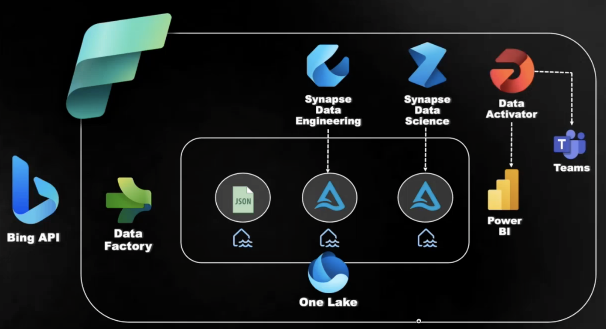

# Bing News Project

This project analyzes Bing news data using Microsoft Fabric notebooks.

## Architecture

<!-- Add a diagram if available -->

    
     
  Project Architecture

## Files
- `notebooks/bing_news_analysis.ipynb`: Main notebook
- `images/screenshot.png`: Project screenshot

## How to run
1. Open the notebook in Microsoft Fabric or Jupyter environment
2. Follow the cells to see the analysis
